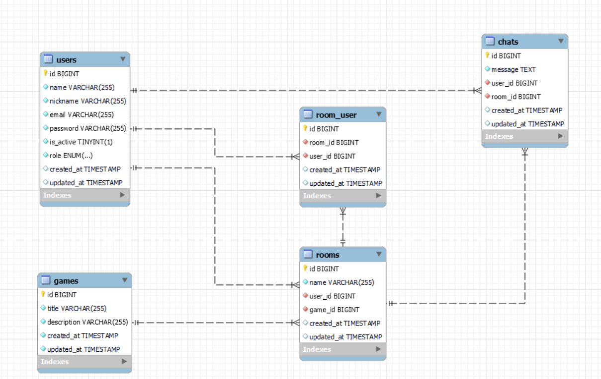

# LARAVEL CHATROOM APP


<details>
  <summary>Content</summary>
  <ol>
    <li><a href="#about-the-project">About the project</a></li>
    <li><a href="#stack">Stack</a></li>
    <li><a href="#database-diagram">Database diagram</a></li>
    <li><a href="#local-installation">Local installation</a></li>
    <li><a href="#credentials">Credentials</a></li>
    <li><a href="#endpoints">Endpoints</a></li>
    <li><a href="#contact">Contact</a></li>
  </ol>
</details>

## About the project


## Stack
Technologies used:
<div align="center">
<a href="https://www.mysql.com/">
    
</a>
<a href="https://www.php.net/">
    
</a>
<a href="https://laravel.com/">
    
</a>
<a href="https://getcomposer.org/">
    
</a>
  <a href="https://git-scm.com/">
    
</a>

</div>


## Database diagram


## Local installation
1. Clone the repository
2. ` $ php artisan install `
3. Set the .env file and adjust the params for the database.
4. Connect to the database.
5. ``` $ php artisan migrate ```
6. ``` $ php artisan db:seed "here put the name of the seed" ``` 
7. ``` $ php artisan serve ``` 

## Credentials
    These are some of the credentials provided in the seeder.
    - user@user.com, password: 123456
    - admin@admin.com, password: 123456
    - superadmin@superadmin.com, password:123456
## Endpoints
<details>
<summary>Endpoints</summary>

- AUTH

    - REGISTER

            POST http://localhost:8000/api/register
        body:
        ``` json
            {
                "name": "",
                "nickname": "",
                "email": "",
                "password": ""
            }
        ```

    - LOGIN

            POST http://localhost:8000/api/login 
        body:
        ``` json
            {
                "email": "",
                "password": ""
            }
        ```
    - PROFILE

            GET http://localhost:8000/api/profile

    - LOGOUT

            POST http://localhost:8000/api/logout


 - USERS
 
    -   GET ALL USERS

            GET http://localhost:8000/api/users?name=&page=&limit=

    -   CREATE USERS

            POST http://localhost:8000/api/users
        body:
        ``` json
            {
                "name": "",
                "nickname": "",
                "email": "",
                "password": ""
            }
        ```
            
    -   DELETE USER BY ID

             DELETE http://localhost:8000/api/users/{id}

    -    UPDATE USER BY ID

             PUT http://localhost:8000/api/users/{id}
         body:
           ``` json
            {
                "name": "",
                "nickname": "",
                "email": "",
                "password": ""
            }
     
- GAMES
 
    - CREATE GAME (Auth: ADMIN/SUPERADMIN)

            POST http://localhost:8000/api/games
        body:
        ``` json
            {
                "title": "example1",
                "description": "example1"
            }
    
   
    - DELETE GAME (Auth: ADMIN/SUPERADMIN)

            DELETE http://localhost:8000/api/games/{id}

    - GET GAMES

            GET http://localhost:8000/api/games


    - UPDATE GAME BY ID (Auth: ADMIN/SUPERADMIN)

            UPDATE http://localhost:8000/api/games/{id}
        body:
         ``` json
            {
                "title": "example1",
                "description": "example1"
            }
         ```
    - GET GAME BY ID

            GET http://localhost:8000/api/games/{id}  

- ROOMS
    - CREATE ROOM 

            POST http://localhost:8000/api/rooms
        body:
        ``` json
            {
                
            }
        ```
  
    - GET ROOM 

            POST http://localhost:8000/api/rooms
       

    - UPDATE ROOM 

            PUT http://localhost:8000/api/rooms/{id}
      body:
        ``` json
            {
            
            }
        ```

    - DELETE ROOM 

            DELETE http://localhost:8000/api/rooms/{id}

    - GET ROOM BY ID

            GET http://localhost:8000/api/rooms/{id}

    - JOIN ROOM

            POST  GET http://localhost:8000/api/rooms/{id}/join

      body:
        ``` json
            {
            
            }

        ```
    - LEAVE ROOM

            GET http://localhost:8000/api/rooms/{id}/leave


- CHATS
 
    - CREATE CHAT 

            POST http://localhost:8000/api/chats
        body:
        ``` json
            {
                "message": " ",
                "room_id": " "
            }
        ```
   
    - DELETE CHAT BY ID

            DELETE http://localhost:8000/api/chats/{id}

    - GET AL CHATS ONE ROOM

            GET http://localhost:8000/api/chats/{id}


    - UPDATE CHAT BY ID 

        
        
## Contact
- **Pedro Fernández** - Project Developer
  - [GitHub](https://github.com/Eryhnar) - [LinkedIn](https://www.linkedin.com/in/pedro-fernandez-bel-68a2b9155/)

- **Claudia Álvaro** - Project Developer
  - [GitHub](https://github.com/klauha) - [LinkedIn](https://www.linkedin.com/in/claudia-álvaro-cano-47860538/)

- **Fernando Elegido** - Project Developer
  - [GitHub](https://github.com/Ferelbue) - [LinkedIn](https://www.linkedin.com/in/fernando-elegido//)

- **Victor Blasco** - Project Developer
  - [GitHub](https://github.com/VictorBlasco5) - [LinkedIn](https://www.linkedin.com/in/víctor-blasco-4b7588304//)


</details>

